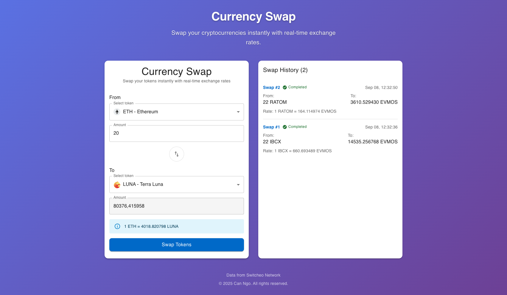

# Problem 2: Currency Swap Application

## Overview

A modern, responsive currency swap application built with React, TypeScript, and Vite. This application allows users to swap cryptocurrencies with real-time exchange rates fetched from the Switcheo Network API.

## Preview



_The currency swap interface showing token selection, real-time exchange rates, and swap history with various transaction statuses._

## Features

- **Real-time Exchange Rates**: Fetches live token prices from Switcheo Network
- **Form Validation**: Comprehensive validation with user-friendly error messages
- **Responsive Design**: Mobile-first design with Material-UI components
- **Loading States**: Smooth loading indicators for better UX
- **Token Selection**: Dropdown selection with token icons, names and symbols
- **Exchange Rate Display**: Shows current exchange rates between selected tokens
- **Swap History**: Displays the last completed swap transaction
- **Error Handling**: Comprehensive error messages and validation

## Tech Stack

- **Frontend Framework**: React 18 with TypeScript
- **Build Tool**: Vite (for fast development and optimized builds)
- **UI Library**: Material-UI (MUI) v6 with Emotion styling
- **Form Management**: Native React state with HTML5 validation
- **HTTP Client**: Axios for API calls
- **Date/Time**: Moment.js for timestamp formatting
- **Icons**: Material-UI Icons

## Project Structure

```
src/
├── components/
│   └── CurrencySwapForm.tsx # Main swap form component with MUI
├── services/
│   └── api.ts              # API service functions
├── types/
│   └── index.ts            # TypeScript type definitions
├── App.tsx                 # Main application component with MUI Theme
├── main.tsx               # Application entry point
└── index.css              # Basic global styles
```

## Key Components

### CurrencySwapForm

The main component that handles:

- Token selection (from/to dropdowns) with icons
- Amount input with validation
- Real-time exchange rate calculation
- Swap functionality with loading states
- Transaction history display

### Form Validation

Using native React state management with HTML5 validation:

- Required token selection
- Positive number validation for amounts
- Maximum amount limits (1,000,000)
- Prevention of same-token swaps
- Real-time error feedback with MUI Alert components

### API Integration

- Fetches token prices from `https://interview.switcheo.com/prices.json`
- Filters tokens with valid prices
- Removes duplicates and uses latest price data
- Adds token icons from Switcheo token repository

## Design Decisions

1. **Material-UI (MUI)**: Using MUI v6 for consistent, accessible, and professional UI components
2. **Responsive Design**: MUI's Grid system and responsive breakpoints for all screen sizes
3. **Real-time Calculations**: Exchange rates update automatically when tokens or amounts change
4. **Loading States**: MUI CircularProgress components for better UX feedback
5. **Error Handling**: MUI Alert components for user-friendly error messages
6. **Theme Customization**: Custom MUI theme with gradient background and modern styling
7. **Accessibility**: MUI components come with built-in accessibility features

## Environment Requirements

- **Node.js**: Version 20.19.0 or higher (or 22.12.0+)
- **npm**: Version 10.0.0 or higher

## Running the Application

1. **Install Dependencies**:

   ```bash
   npm install
   ```

2. **Start Development Server**:

   ```bash
   npm run dev
   ```

3. **Build for Production**:

   ```bash
   npm run build
   ```

4. **Preview Production Build**:
   ```bash
   npm run preview
   ```

## API Endpoints Used

- **Token Prices**: `https://interview.switcheo.com/prices.json`
- **Token Icons**: `https://raw.githubusercontent.com/Switcheo/token-icons/main/tokens/{SYMBOL}.svg`

## Mock API Behavior & Testing

The application includes simulated API behavior to demonstrate different swap scenarios:

### Success Cases

- **Normal swaps**: Amounts between 0.01 and 20,000 will complete successfully
- **Real-time feedback**: 2-second delay simulates actual API calls
- **History tracking**: All successful swaps are recorded with timestamps

### Failure Cases

- **High amount threshold**: Amounts above **20,000** will simulate API failure
- **Error handling**: Failed swaps are recorded in history with "failed" status
- **User feedback**: Clear error messages explain why the swap failed

### Cancellation

- **User control**: Users can cancel swaps during the 2-second processing delay
- **Cancel button**: Appears during swap processing
- **History tracking**: Cancelled swaps are recorded with "cancelled" status

### Testing Different Scenarios

1. **Test Success**: Enter amount ≤ 20,000 (e.g., 1000 BTC → ETH)
2. **Test Failure**: Enter amount > 20,000 (e.g., 25000 BTC → ETH)
3. **Test Cancellation**: Start a swap and click "Cancel" before completion
4. **Test Prevention**: Try selecting the same token for both From and To fields

### Configuration

All thresholds and delays are configurable in `src/constants/config.ts`:

```typescript
export const VALIDATION_CONFIG = {
  MAX_AMOUNT: 1000000, // Maximum allowed amount
  MIN_AMOUNT: 0, // Minimum allowed amount
  FAILURE_THRESHOLD: 20000, // Amounts above this simulate API failure
} as const;

export const UI_CONFIG = {
  SWAP_DELAY_MS: 2000, // Simulated API call delay
} as const;
```

## Future Enhancements

- Add dark mode support
- Implement slippage tolerance settings
- Add transaction history persistence
- Include more detailed token information
- Add price charts and historical data
- Implement wallet connection
- Add more sophisticated error handling
- Include unit and integration tests

## Browser Support

- Chrome (latest)
- Firefox (latest)
- Safari (latest)
- Edge (latest)

---
